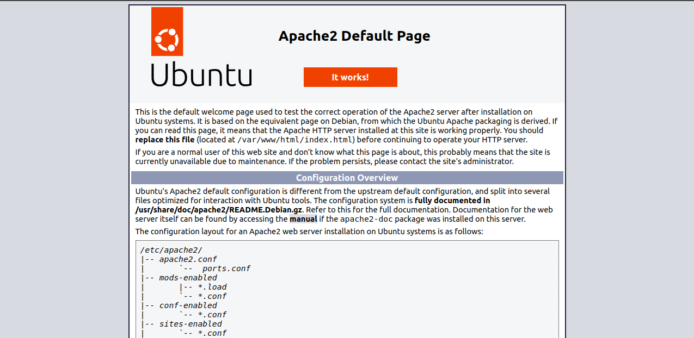

# tf-hands-on

A Terraform project that deploys a scalable web infrastructure on AWS.

## outputs


## output


## Infrastructure Overview

This project creates:
- VPC with public subnets in us-east-1
- Auto Scaling Group with Apache2 web servers
- Application Load Balancer
- Security Groups for web and load balancer traffic
- Launch Template for EC2 instances

## Usage

1. Configure AWS credentials
2. Initialize Terraform:
```
terraform init
```
3. Apply the configuration:
```
terraform apply
```

